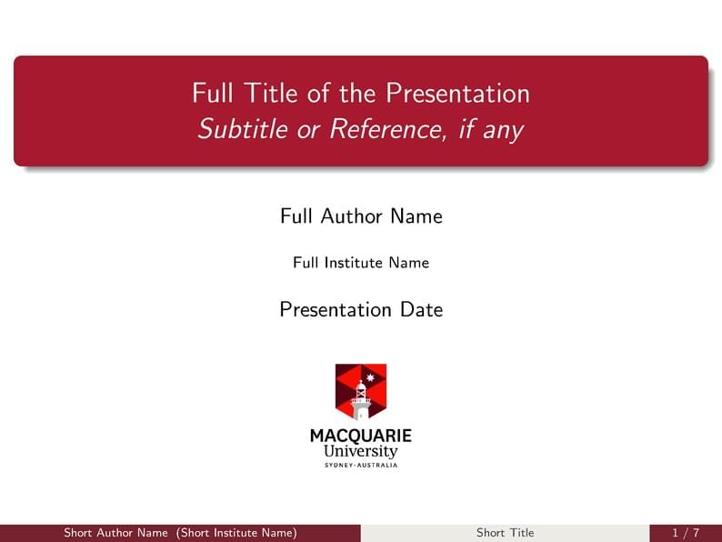

# Macquarie University Beamer Template

## Overview

This repository contains the Macquarie University Beamer Template for presentations using LaTeX. The template adheres to university branding guidelines and includes various customization options.

## Preview

You can view a live version of the template in action by visiting the [Overleaf Gallery](https://www.overleaf.com/latex/templates/macquarie-university-beamer-template/gctpdnnzsgvp).

## Features

- **Custom Colors**: The template uses custom colors specific to Macquarie University, including `mqred`, `mqdeepred`, `mqgray`, `mqlightgray`, and `mqmagenta`. These colors are applied to various elements to match the university's branding.
- **Footnote Arrangement**: The footline is customized to display the author's name, presentation title, and page numbers in a structured manner.
- **Logo**: Includes an option to add a university logo in the header.
